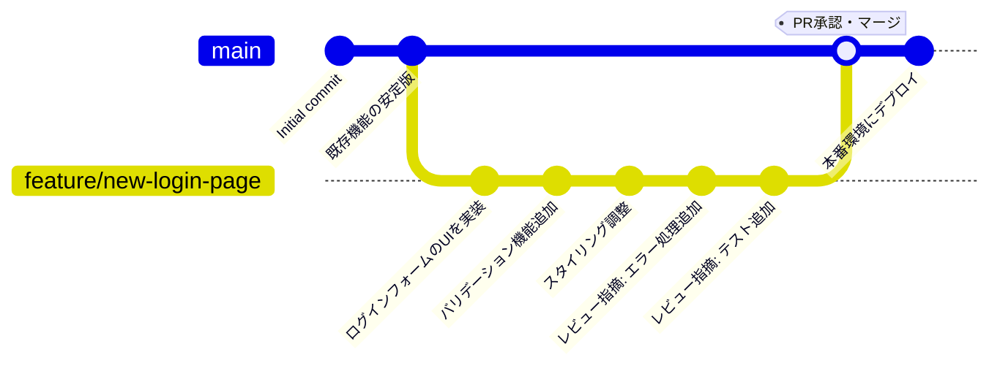

# 第 3 回振り返りレポート

## 1. GitHub アカウントと URL

アカウント名: wappon28dev
Account URL: <https://github.com/wappon28dev>

## 2. グループの Organization の URL

Organization URL: <https://github.com/2025AIT-OOP2-1-G06>

## 3. 作成した日記リポジトリのコミットログ

日記リポジトリの URL: <https://github.com/2025AIT-OOP2-1-G06/Diary>

<pre>

* commit 940b73e0ab6275889247c9d5d22adc03470d2958 (HEAD -> main, origin/main, origin/HEAD)
| Author: 中島朝登 <asato624@icloud.com>
| Date:   Thu Oct 16 16:28:47 2025 +0900
|
|     hennkou-03
|
*   commit 204539ae1342658a9e17f60bc638ccb166f26c26
|\  Merge: ef12937 5fa0325
| | Author: 中島朝登 <asato624@icloud.com>
| | Date:   Thu Oct 16 16:14:48 2025 +0900
| |
| |     Merge branch 'main' of https://github.com/2025AIT-OOP2-1-G06/Diary
| |
| *   commit 5fa0325d54c92d63ccbe623f872137917f951eaf
| |\  Merge: 70c336a cd77dba
| | | Author: あらた <136658330+arata-06@users.noreply.github.com>
| | | Date:   Thu Oct 16 16:14:00 2025 +0900
| | |
| | |     Merge pull request #5 from 2025AIT-OOP2-1-G06/arata-add-new
| | |
| | |     Update arataDiary.py
| | |
| | * commit cd77dbaebc997ad330c5c4bebd8cddbb93a9da8b (origin/arata-add-new)
| | | Author: あらた <136658330+arata-06@users.noreply.github.com>
| | | Date:   Thu Oct 16 16:13:26 2025 +0900
| | |
| | |     Update arataDiary.py
| | |
* | | commit ef1293756fd8d2e50d72947151bfa9b14dee2191
|/ /  Author: 中島朝登 <asato624@icloud.com>
| |   Date:   Thu Oct 16 16:14:38 2025 +0900
| |
| |       hennkou-02
| |
* | commit 70c336ad1bd1a1ecf23dec82433af5bf93541a42
| | Author: 中島朝登 <asato624@icloud.com>
| | Date:   Thu Oct 16 15:41:59 2025 +0900
| |
| |     jinma-hennkou-01
| |
* | commit e62f29a89af425cd5df14cfeeeaee53af547d97a
| | Author: wappon28dev <wappon_28_dev@ruru.be>
| | Date:   Thu Oct 16 15:45:05 2025 +0900
| |
| |     🎨 main 側でインポート
| |
* | commit 5a8bd6285a278768b507d3a9ec1dd72b3d96301a
| | Author: wappon28dev <wappon_28_dev@ruru.be>
| | Date:   Thu Oct 16 15:44:12 2025 +0900
| |
| |     ✨ わっぽんの日記
| |
* | commit 4efa02b6fa2e3950a327826fba45b255aae099ee
|\| Merge: 057307d ed6c6b8
| | Author: あらた <136658330+arata-06@users.noreply.github.com>
| | Date:   Thu Oct 16 15:47:16 2025 +0900
| |
| |     Merge pull request #4 from 2025AIT-OOP2-1-G06/arata-add-new
| |
| |     あらたの日記
| |
| * commit ed6c6b85d6f9caae771e5df7f2e2331f468c950b
| | Author: あらた <136658330+arata-06@users.noreply.github.com>
| | Date:   Thu Oct 16 15:18:21 2025 +0900
| |
| |     あらたの日記
| |
* | commit 057307d7ca82f7a52a5107ebd89bd872e98ee963
|/  Author: ganbaruru <takuto2234@icloud.com>
|   Date:   Thu Oct 16 15:18:46 2025 +0900
|
|       ganbaruruDiary-add
|
* commit c0cf3aab15316680883dc81a26f8c44636c351e6
| Author: 中島朝登 <asato624@icloud.com>
| Date:   Thu Oct 16 14:57:19 2025 +0900
|
|     matidasp
|
* commit 9be62d60c8a34df61964eb3f4f8f3bb114ebb1a7
| Author: 中島朝登 <asato624@icloud.com>
| Date:   Thu Oct 16 14:54:18 2025 +0900
|
|     tuika
|
* commit 5817495fc60ad06d12c71cf01fe1151652535f00
  Author: 中島朝登 <asato624@icloud.com>
  Date:   Thu Oct 16 14:46:06 2025 +0900
  
      Initial commit

</pre>

## ４. Git, GitHub に関する調査

### 4-1. Git を始めとしたバージョン管理システムを利用することによるメリットはなにか

# Git とバージョン管理に関するレポート

## 4-1. バージョン管理システムを利用するメリット

バージョン管理システムを利用することで、以下のメリットが得られる。

まず、変更履歴の完全な記録が可能となる。すべての変更がいつ、誰によって、なぜ行われたかを追跡でき、問題が発生した際には過去の任意の状態に戻すことができる。

次に、複数人での並行作業が効率化される。各開発者が独立して作業を進め、後で変更を統合できるため、チーム開発における生産性が向上する。

また、実験的な機能開発が安全に行える。本番環境に影響を与えることなく新機能を試すことができ、失敗しても元の状態に容易に戻せる。

さらに、コードレビューとの統合により、品質管理が強化される。変更内容を他のメンバーが確認してから統合することで、バグの早期発見とコード品質の向上が実現する[^1]。

## 4-2. Git の主要なキーワード

### 「clone」

リモートリポジトリの完全なコピーをローカル環境に作成する操作である。すべての履歴とブランチ情報を含めてダウンロードし、ローカルで作業を開始できる状態にする[^2]。

### 「commit」

作業ディレクトリの変更をリポジトリの履歴として記録する操作である。変更内容にメッセージを付けてスナップショットとして保存し、プロジェクトの歴史を構築する基本単位となる[^3]。

### 「push」

ローカルリポジトリのコミットをリモートリポジトリにアップロードする操作である。自分の作業内容を他のメンバーと共有し、チーム全体で最新の状態を保つために使用する[^4]。

### 「branch」

開発の流れを分岐させ、独立した作業ラインを作成する機能である。メインの開発ラインに影響を与えずに新機能の開発やバグ修正を行い、完成後に統合することができる[^5]。

### 「fetch」

リモートリポジトリの最新情報をローカルにダウンロードするが、作業ディレクトリには反映しない操作である。リモートの変更内容を確認してから、必要に応じてマージやリベースを行うことができる[^3]。

### 「pull」

リモートリポジトリの変更を取得し、現在のブランチに自動的にマージする操作である。fetch と merge を一度に実行するため、他のメンバーの作業内容を素早く自分の環境に反映できる[^3]。

### 「merge」

異なるブランチの変更履歴を統合する操作である。両方のブランチの変更を保持したまま、新しいマージコミットを作成して履歴を統合する[^6]。

### 「rebase」

あるブランチの変更を別のブランチの最新状態を基点として付け替える操作である。コミット履歴を直線的に保つことができ、マージコミットを作らずに変更を統合できる[^6]。

## 4-3. GitHub Flow によるチーム開発の問題解決

GitHub Flow を採用することで、以下のチーム開発における問題が解決できる。

まず、コードレビューの仕組みが標準化される。Pull Request を通じてすべての変更が他のメンバーに確認されるため、コード品質が担保され、知識の共有も促進される。

次に、本番環境への影響を最小化できる。メインブランチを常にデプロイ可能な状態に保つことで、いつでも安全にリリースできる体制が構築される。

また、作業の透明性が向上する。各機能開発がブランチと Pull Request で管理されるため、誰が何に取り組んでいるかがチーム全体で把握しやすくなる[^7]。

### GitHub Flow の作業手順

GitHub Flow での実際の作業手順は以下の通りである。



まず、メインブランチから機能開発用のブランチを作成する。ブランチ名は作業内容を表す分かりやすい名前にする。

```bash
git checkout -b feature/new-login-page
```

次に、そのブランチで開発作業を行い、適切な単位でコミットを重ねる。各コミットメッセージは変更内容を明確に記述する。

```bash
git add .
git commit -m "ログインフォームのUIを実装"
```

開発が進んだら、定期的にリモートリポジトリにプッシュする。これにより作業内容がバックアップされ、他のメンバーも進捗を確認できる。

```bash
git push origin feature/new-login-page
```

機能が完成したら、GitHub で Pull Request を作成する。変更内容の説明を詳しく記述し、必要に応じてレビュアーを指定する[^8]。

レビュアーからのフィードバックに対応し、必要な修正を同じブランチにコミットする。Pull Request は自動的に更新される。

承認を得たら、Pull Request をメインブランチにマージする。マージ後、機能ブランチは削除して環境を整理する[^7]。

最後に、メインブランチを本番環境にデプロイする。GitHub Flow では、メインブランチは常にデプロイ可能な状態に保たれるため、安心してリリースできる。

この一連の流れにより、品質管理とチーム協調が両立した開発プロセスが実現する。

## 参考文献

[^1]: GitHub Docs, "GitHub について," <https://docs.github.com/ja/get-started/using-github/about-github> (閲覧日: 2025-10-22).
[^2]: GitHub Docs, "リポジトリをクローンする," <https://docs.github.com/ja/repositories/creating-and-managing-repositories/cloning-a-repository> (閲覧日: 2025-10-22).
[^3]: GitHub Docs, "Git について," <https://docs.github.com/ja/get-started/using-git/about-git> (閲覧日: 2025-10-22).
[^4]: GitHub Docs, "リモートリポジトリについて," <https://docs.github.com/ja/get-started/getting-started-with-git/about-remote-repositories> (閲覧日: 2025-10-22).
[^5]: GitHub Docs, "ブランチについて," <https://docs.github.com/ja/pull-requests/collaborating-with-pull-requests/proposing-changes-to-your-work-with-pull-requests/about-branches> (閲覧日: 2025-10-22).
[^6]: GitHub Docs, "Git rebase について," <https://docs.github.com/ja/get-started/using-git/about-git-rebase> (閲覧日: 2025-10-22).
[^7]: GitHub Docs, "GitHub flow," <https://docs.github.com/ja/get-started/using-github/github-flow> (閲覧日: 2025-10-22).
[^8]: GitHub Docs, "pull request について," <https://docs.github.com/ja/pull-requests/collaborating-with-pull-requests/proposing-changes-to-your-work-with-pull-requests/about-pull-requests> (閲覧日: 2025-10-22).
